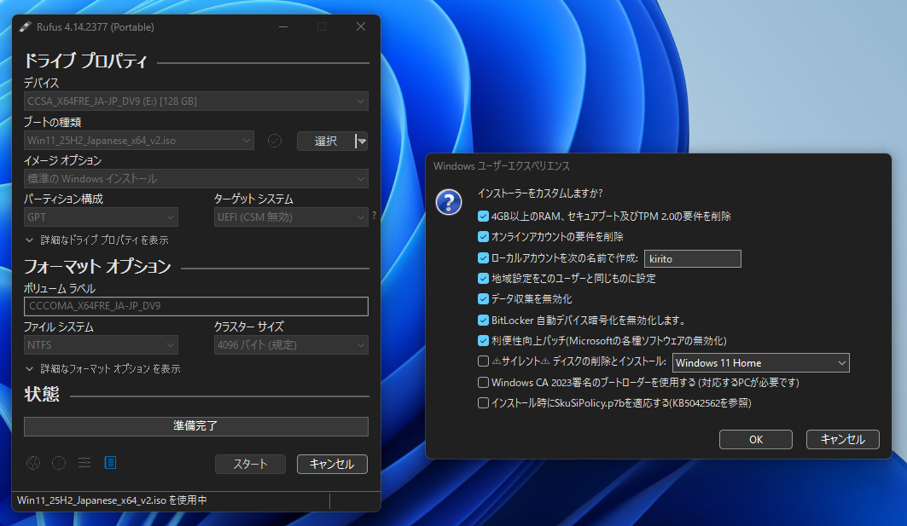

内容を理解した上で実行してね。操作を誤るとパソコンが爆発します。

## windows11をインストール

Rufusでブートメディアを作成してインストール。

https://rufus.ie/ja/



## ディスプレイ設定

解像度、拡大縮小、リフレッシュレートを変更。

## Windows Update

更新がなくなるまで当てる。

## ソフトウェアのインストールと設定

以下の内容を `run.bat` として保存。

PS1ファイルをこのbatにドラッグ＆ドロップすると、管理者権限で実行できる。

```bat
@echo off
powershell -NoProfile -ExecutionPolicy Bypass -File "%~1"
pause
```

コメント部分に日本語があると文字化けするため、エンコードはANSIで以下の内容を `install.ps1` として保存し、`run.bat` にドラッグして実行する。wingetでソフトウェアをまとめてインストールする。

```powershell
$packageIds = @(
    # ブラウザ
    'Google.Chrome'

    # VPN
    'NordSecurity.NordVPN'

    # ゲーム
    'Valve.Steam'
    'EpicGames.EpicGamesLauncher'

    # ビデオ
    'MPC-BE.MPC-BE'

    # コミュニケーション
    'Discord.Discord'
    'RomTenma.Siki'

    # 開発
    'Microsoft.VisualStudioCode'
    'Git.Git'
    'Microsoft.PowerShell'
    'OpenJS.NodeJS'
    'GitHub.cli'

    # ユーティリティ
    'Microsoft.PowerToys'
    'M2Team.NanaZip'
)

foreach ($packageId in $packageIds) {
    winget install -e --id $packageId --accept-source-agreements --accept-package-agreements
}
```

以下の内容を `setting.ps1` として保存し、`run.bat` にドラッグして実行する。電源・マウスの初期設定を行う。

```powershell
# 管理者権限の昇格
$principal = New-Object Security.Principal.WindowsPrincipal([Security.Principal.WindowsIdentity]::GetCurrent())
if (-not $principal.IsInRole([Security.Principal.WindowsBuiltInRole]::Administrator)) {
    Start-Process pwsh -Verb RunAs -ArgumentList @('-NoProfile', '-ExecutionPolicy', 'Bypass', '-File', $PSCommandPath)
    exit
}

# 電源設定
powercfg -x monitor-timeout-ac 5   # 5分後にモニターをオフ
powercfg -x standby-timeout-ac 0   # スリープしない

# マウス加速を無効化
$mouse = 'HKCU:\Control Panel\Mouse'
Set-ItemProperty -Path $mouse -Name MouseSpeed      -Value '0'
Set-ItemProperty -Path $mouse -Name MouseThreshold1 -Value '0'
Set-ItemProperty -Path $mouse -Name MouseThreshold2 -Value '0'
```

生でコンソールにぶち込んでもいいけどファイルと残しておくとアップデートが楽。

## 手動インストール

wingetで取得できなかったりパッケージマネージャ経由だと動作しないドライバ・ソフトウェアを手動でインストールする。

Nvidia App（GeForce Driver、Nvidia Broadcastのインストールもここから行う）

https://www.nvidia.com/ja-jp/software/nvidia-app/

Aqua Voice

https://aquavoice.com/download

MOTU M Series

https://motu.com/en-us/download/product/408/#3110

## ソフトのアンインストールと設定変更

レジストリの編集やソフトのアンインストールを行う。Windowsの仕様変更についていくのが面倒なので、オープンソースで長期間保守されているツールを使うのがよさげ。

https://github.com/Raphire/Win11Debloat

以下のワンライナーを実行。

```powershell
& ([scriptblock]::Create((irm "https://debloat.raphi.re/")))
```

GUIが立ち上がるので操作を行う。

1. 右上の ≡ をクリック → Import config
2. 以下の内容をJSONファイルとして保存したものを読み込む
3. Apply Changes

レジストリの変更を元に戻す場合は ≡ → Restore backup。

```json
{
    "Apps":  [
                 "Microsoft.3DBuilder",
                 "Microsoft.Microsoft3DViewer",
                 "ACGMediaPlayer",
                 "ActiproSoftwareLLC",
                 "AdobeSystemsIncorporated.AdobePhotoshopExpress",
                 "Microsoft.WindowsAlarms",
                 "Amazon.com.Amazon",
                 "Asphalt8Airborne",
                 "AutodeskSketchBook",
                 "Microsoft.BingFinance",
                 "Microsoft.BingFoodAndDrink",
                 "Microsoft.BingHealthAndFitness",
                 "Microsoft.BingNews",
                 "Microsoft.BingSearch",
                 "Microsoft.BingSports",
                 "Microsoft.BingTranslator",
                 "Microsoft.BingTravel",
                 "Microsoft.BingWeather",
                 "king.com.BubbleWitch3Saga",
                 "CaesarsSlotsFreeCasino",
                 "Microsoft.WindowsCalculator",
                 "Microsoft.WindowsCamera",
                 "king.com.CandyCrushSaga",
                 "king.com.CandyCrushSodaSaga",
                 "Clipchamp.Clipchamp",
                 "COOKINGFEVER",
                 "Microsoft.Copilot",
                 "Microsoft.Windows.AIHub",
                 "Microsoft.549981C3F5F10",
                 "MicrosoftWindows.CrossDevice",
                 "CyberLinkMediaSuiteEssentials",
                 "DellInc.DellDigitalDelivery",
                 "DellInc.DellMobileConnect",
                 "DellInc.DellSupportAssistforPCs",
                 "Microsoft.Windows.DevHome",
                 "Disney",
                 "DisneyMagicKingdoms",
                 "DrawboardPDF",
                 "Duolingo-LearnLanguagesforFree",
                 "EclipseManager",
                 "Facebook",
                 "MicrosoftCorporationII.MicrosoftFamily",
                 "FarmVille2CountryEscape",
                 "Microsoft.WindowsFeedbackHub",
                 "fitbit",
                 "Flipboard",
                 "Microsoft.GetHelp",
                 "Microsoft.Getstarted",
                 "HiddenCity",
                 "AD2F1837.HPAIExperienceCenter",
                 "AD2F1837.HPConnectedMusic",
                 "AD2F1837.HPConnectedPhotopoweredbySnapfish",
                 "AD2F1837.HPDesktopSupportUtilities",
                 "AD2F1837.HPEasyClean",
                 "AD2F1837.HPFileViewer",
                 "AD2F1837.HPJumpStarts",
                 "AD2F1837.HPPCHardwareDiagnosticsWindows",
                 "AD2F1837.HPPowerManager",
                 "AD2F1837.HPPrinterControl",
                 "AD2F1837.HPPrivacySettings",
                 "AD2F1837.HPQuickDrop",
                 "AD2F1837.HPQuickTouch",
                 "AD2F1837.HPRegistration",
                 "AD2F1837.HPSupportAssistant",
                 "AD2F1837.HPSureShieldAI",
                 "AD2F1837.HPSystemInformation",
                 "AD2F1837.HPWelcome",
                 "AD2F1837.HPWorkWell",
                 "HULULLC.HULUPLUS",
                 "iHeartRadio",
                 "Instagram",
                 "E046963F.LenovoCompanion",
                 "LenovoCompanyLimited.LenovoVantageService",
                 "LinkedInforWindows",
                 "Sidia.LiveWallpaper",
                 "Microsoft.windowscommunicationsapps",
                 "MarchofEmpires",
                 "Microsoft.ZuneMusic",
                 "Microsoft.Messaging",
                 "Microsoft.M365Companions",
                 "Microsoft.MicrosoftJournal",
                 "Microsoft.News",
                 "Microsoft.PCManager",
                 "MSTeams",
                 "MicrosoftTeams",
                 "Microsoft.Todos",
                 "Microsoft.MixedReality.Portal",
                 "Microsoft.ZuneVideo",
                 "AD2F1837.myHP",
                 "Netflix",
                 "Microsoft.NetworkSpeedTest",
                 "NYTCrossword",
                 "Microsoft.MicrosoftOfficeHub",
                 "OneCalendar",
                 "Microsoft.OneConnect",
                 "Microsoft.OneDrive",
                 "Microsoft.Office.OneNote",
                 "Microsoft.OutlookForWindows",
                 "Microsoft.Paint",
                 "Microsoft.MSPaint",
                 "PandoraMediaInc",
                 "Microsoft.People",
                 "Microsoft.YourPhone",
                 "PhototasticCollage",
                 "PicsArt-PhotoStudio",
                 "Plex",
                 "PolarrPhotoEditorAcademicEdition",
                 "Microsoft.MicrosoftPowerBIForWindows",
                 "AmazonVideo.PrimeVideo",
                 "Microsoft.Print3D",
                 "MicrosoftCorporationII.QuickAssist",
                 "Microsoft.RemoteDesktop",
                 "Royal Revolt",
                 "Shazam",
                 "Microsoft.SkypeApp",
                 "SlingTV",
                 "Microsoft.MicrosoftSolitaireCollection",
                 "Microsoft.WindowsSoundRecorder",
                 "Spotify",
                 "Microsoft.MicrosoftStickyNotes",
                 "Microsoft.Office.Sway",
                 "TikTok",
                 "TuneInRadio",
                 "Twitter",
                 "Viber",
                 "Microsoft.Whiteboard",
                 "Microsoft.StartExperiencesApp",
                 "Microsoft.WidgetsPlatformRuntime",
                 "Microsoft.WindowsMaps",
                 "MicrosoftWindows.Client.WebExperience",
                 "WinZipUniversal",
                 "Wunderlist",
                 "Microsoft.XboxApp",
                 "Microsoft.XboxGameOverlay",
                 "Microsoft.GamingApp",
                 "Microsoft.XboxGamingOverlay",
                 "Microsoft.XboxIdentityProvider",
                 "Microsoft.XboxSpeechToTextOverlay",
                 "Microsoft.Xbox.TCUI",
                 "XING"
             ],
    "Tweaks":  [
                   { "Value": true, "Name": "DisableSettings365Ads" },
                   { "Value": true, "Name": "EnableDarkMode" },
                   { "Value": true, "Name": "DisableBitlockerAutoEncryption" },
                   { "Value": true, "Name": "HideSearchTb" },
                   { "Value": true, "Name": "DisableTelemetry" },
                   { "Value": true, "Name": "DisableWidgets" },
                   { "Value": true, "Name": "DisableLockscreenTips" },
                   { "Value": true, "Name": "DisableAISvcAutoStart" },
                   { "Value": true, "Name": "DisableStartPhoneLink" },
                   { "Value": true, "Name": "DisableStartRecommended" },
                   { "Value": true, "Name": "DisableMouseAcceleration" },
                   { "Value": true, "Name": "DisableStoreSearchSuggestions" },
                   { "Value": true, "Name": "DisableDeliveryOptimization" },
                   { "Value": true, "Name": "HideTaskview" },
                   { "Value": true, "Name": "DisableGameBarIntegration" },
                   { "Value": true, "Name": "DisableDVR" },
                   { "Value": true, "Name": "DisableSuggestions" },
                   { "Value": true, "Name": "ShowKnownFileExt" },
                   { "Value": true, "Name": "ClearStart" },
                   { "Value": true, "Name": "DisableDesktopSpotlight" },
                   { "Value": true, "Name": "HideOnedrive" },
                   { "Value": true, "Name": "HideGallery" },
                   { "Value": true, "Name": "EnableEndTask" },
                   { "Value": true, "Name": "ShowHiddenFolders" },
                   { "Value": true, "Name": "DisableEdgeAI" },
                   { "Value": true, "Name": "DisableSettingsHome" },
                   { "Value": true, "Name": "DisableNotepadAI" },
                   { "Value": true, "Name": "DisableStickyKeys" },
                   { "Value": true, "Name": "DisableFindMyDevice" },
                   { "Value": true, "Name": "DisableCopilot" },
                   { "Value": true, "Name": "DisableClickToDo" },
                   { "Value": true, "Name": "DisableBing" },
                   { "Value": true, "Name": "DisableUpdateASAP" },
                   { "Value": true, "Name": "DisableRecall" },
                   { "Value": true, "Name": "DisableDragTray" },
                   { "Value": true, "Name": "ExplorerToThisPC" },
                   { "Value": true, "Name": "DisableEdgeAds" },
                   { "Value": true, "Name": "DisableLocationServices" },
                   { "Value": true, "Name": "DisablePaintAI" }
               ],
    "Deployment":  [
                       { "Value": 0,    "Name": "UserSelectionIndex" },
                       { "Value": 0,    "Name": "AppRemovalScopeIndex" },
                       { "Value": true, "Name": "CreateRestorePoint" },
                       { "Value": true, "Name": "RestartExplorer" }
                   ],
    "Version":  "1.0"
}
```

## Git

```powershell
git config --global user.name "名前"
git config --global user.email "メールアドレス"
git config --global core.autocrlf true
```

## GitHub CLI

```powershell
gh auth login
```

## Claude Code

```powershell
irm https://claude.ai/install.ps1 | iex
```

パスを通す

```powershell
[Environment]::SetEnvironmentVariable("Path", [Environment]::GetEnvironmentVariable("Path", "User") + ";" + (Join-Path $HOME ".local\bin"), "User")
```

## Caps Lockを消す

Caps LockをPowerToysのKeyboard Managerで別のキーに割り当てる。

## スタートアップの整理

不要なソフトを無効化。