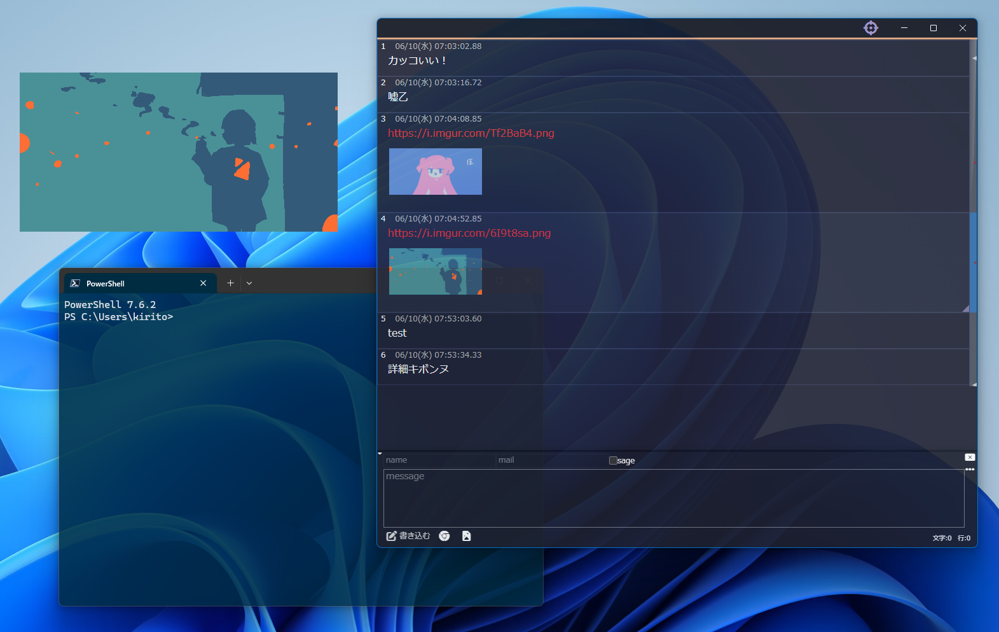

プラグインで起動時にスクリプトを走らせられるので、それを使ってウィンドウを常に半透明にする。



https://sikiapp.net/

## 手順

Siki のプラグインは、plugins フォルダに置いて有効化する仕組み。
公式が配布している startup プラグイン（起動時に一度だけスクリプトを実行する雛形）をベースに、ウィンドウの透過処理を書き加える。

### 1. startup プラグインをダウンロード

公式のプラグイン配布ページから startup プラグインを入手する。

https://sikiapp.net/plugins/

### 2. plugins フォルダに配置

エクスプローラーのアドレスバーに次のパスを貼り付けて開く。

```
%APPDATA%\Siki\profile\plugins
```

ダウンロードした `startup.zip` を展開し、出てきたフォルダをそのまま置く。

### 3. index.js を編集する

`startup` フォルダ内の `index.js` を開き、中身を丸ごと次のコードに置き換える。
これは Electron の `setOpacity` を呼んで、ウィンドウの不透明度を下げるスクリプト。

```js
/** 
  * Sikiの起動時に一度だけ実行されるスクリプト 
  * フォルダをpluginsへ配置して有効化
  * 
  * @version 0.0.1
 */

/**
 * プラグインのタイプ
 * startupは起動時にmainScriptの内容を一度だけ実行します
 */
module.exports.type = 'startup'

/**
 * プラグインの情報
 */
module.exports.meta = {
  name: 'startup',
  description: 'startup',
  version: '1.0.0',
  needVersion: '0.24.7'
}

/**
 * 
 * @param {Object} settings 
 * @param {{[key: string]: any}} settings.config - config.jsに記述された設定内容
 * @param {{[key: string]: any}} settings.userSettings - user.jsに記述された設定内容
 */
module.exports.mainScript = async (settings) => {
  const { BrowserWindow } = require('electron')
  const win = BrowserWindow.getAllWindows()[0]
  const OPACITY = 0.9

  const applyOpacity = () => win.setOpacity(OPACITY)

  win.on('focus', applyOpacity)
  setTimeout(applyOpacity, 500)

}
```

:::tip
`OPACITY = 0.9` の値で透過度を調整できる。1 が不透明、0 が完全に透明。
:::

### 4. 設定を適用する

1. Siki を再起動する
2. 設定 ＞ プラグイン から startup にチェックを入れる
3. もう一度再起動する

スクリプトが読み込まれ、ウィンドウが半透明になる。
