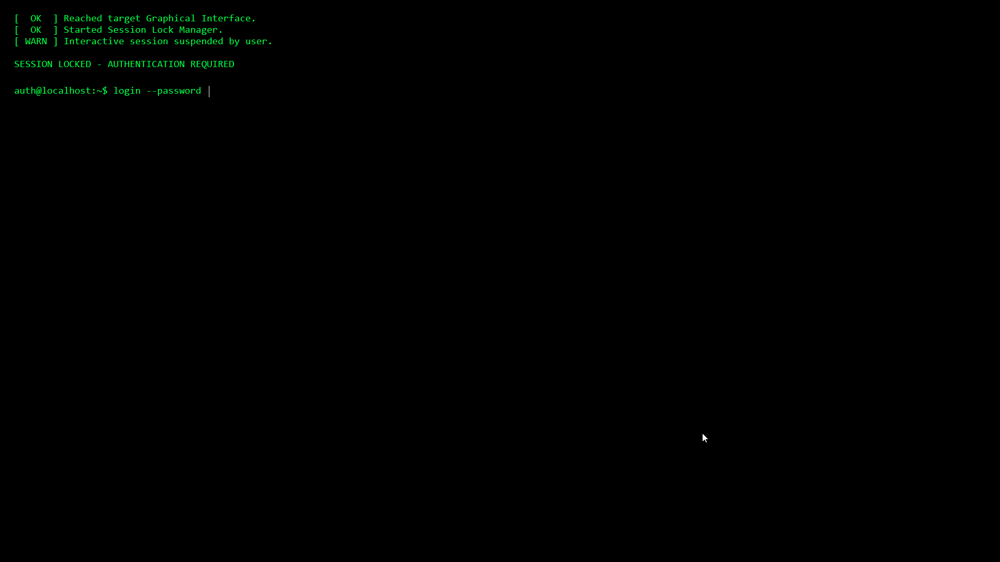

グランブルーファンタジー リリンクにハマっています。

https://store.steampowered.com/app/881020/

MSP 稼ぎでルシファーを日々オートで回しているのですが、必要な量があまりにも狂っているので職場でも Excel の裏で回しておきたくなりました。

問題は席を離れるときで、Win+L でロックするとゲームがそれを検知して周回が止まります。
ただ、別のウィンドウにフォーカスが移っただけなら止まりません。

画面さえ隠れていれば十分なので、偽のロック画面を PowerShell で書きました。

## 使い方

実行するとウィンドウを出さずに常駐します。
Ctrl+F12 で画面全体を覆い、パスワードを入れると戻ります。



表示中は Windows キー、Alt+Tab、Alt+F4、Ctrl+Esc、Alt+Esc が効きません。

## fake-lock.ps1

```powershell
if ([Threading.Thread]::CurrentThread.GetApartmentState() -ne 'STA') {
    $ps = "$env:SystemRoot\System32\WindowsPowerShell\v1.0\powershell.exe"
    Start-Process $ps '-STA -NoProfile -WindowStyle Hidden -ExecutionPolicy Bypass -File', "`"$PSCommandPath`""
    exit
}

$Password = "1223"

Add-Type -AssemblyName System.Windows.Forms, System.Drawing

Add-Type @'
using System;
using System.Runtime.InteropServices;

public class KeyBlocker
{
    const int WH_KEYBOARD_LL = 13;
    static IntPtr hookId = IntPtr.Zero;
    static Func proc = HookCallback;

    public delegate IntPtr Func(int nCode, IntPtr wParam, IntPtr lParam);

    [DllImport("user32.dll", SetLastError = true)]
    static extern IntPtr SetWindowsHookEx(int idHook, Func lpfn, IntPtr hMod, uint tid);
    [DllImport("user32.dll")]
    static extern bool UnhookWindowsHookEx(IntPtr hhk);
    [DllImport("user32.dll")]
    static extern IntPtr CallNextHookEx(IntPtr hhk, int nCode, IntPtr wParam, IntPtr lParam);
    [DllImport("user32.dll")]
    static extern short GetKeyState(int vk);
    [DllImport("user32.dll")]
    static extern short GetAsyncKeyState(int vk);
    [DllImport("kernel32.dll")]
    static extern IntPtr GetModuleHandle(string name);

    public static bool Down(int vk) { return (GetAsyncKeyState(vk) & 0x8000) != 0; }

    public static void Start()
    {
        hookId = SetWindowsHookEx(WH_KEYBOARD_LL, proc, GetModuleHandle(null), 0);
        if (hookId == IntPtr.Zero) throw new System.ComponentModel.Win32Exception(Marshal.GetLastWin32Error());
    }

    public static void Stop()
    {
        if (hookId != IntPtr.Zero) { UnhookWindowsHookEx(hookId); hookId = IntPtr.Zero; }
    }

    static IntPtr HookCallback(int nCode, IntPtr wParam, IntPtr lParam)
    {
        if (nCode >= 0)
        {
            int vk = Marshal.ReadInt32(lParam);
            bool alt = (GetKeyState(0x12) & 0x8000) != 0;
            bool ctrl = (GetKeyState(0x11) & 0x8000) != 0;
            if (vk == 0x5B || vk == 0x5C) return (IntPtr)1;
            if (vk == 0x09 && alt) return (IntPtr)1;
            if (vk == 0x1B && (alt || ctrl)) return (IntPtr)1;
            if (vk == 0x73 && alt) return (IntPtr)1;
        }
        return CallNextHookEx(hookId, nCode, wParam, lParam);
    }
}
'@

$green = [Drawing.Color]::FromArgb(0, 255, 65)
$mono = New-Object Drawing.Font('Consolas', 14)
$margin = 24

function Show-Lock {
    $form = New-Object Windows.Forms.Form
    $form.FormBorderStyle = 'None'
    $form.StartPosition = 'Manual'
    $form.TopMost = $true
    $form.BackColor = 'Black'
    $form.ShowInTaskbar = $false
    $form.Bounds = [Windows.Forms.SystemInformation]::VirtualScreen
    $form.KeyPreview = $true

    function New-Label($text) {
        $l = New-Object Windows.Forms.Label
        $l.Text = $text
        $l.ForeColor = $green
        $l.BackColor = 'Black'
        $l.Font = $mono
        $l.AutoSize = $true
        $form.Controls.Add($l)
        $l
    }

    $header = New-Label @"
[  OK  ] Reached target Graphical Interface.
[  OK  ] Started Session Lock Manager.
[ WARN ] Interactive session suspended by user.

SESSION LOCKED - AUTHENTICATION REQUIRED
"@
    $prompt = New-Label 'auth@localhost:~$ login --password '
    $status = New-Label ''

    $box = New-Object Windows.Forms.TextBox
    $box.UseSystemPasswordChar = $true
    $box.BorderStyle = 'None'
    $box.BackColor = 'Black'
    $box.ForeColor = $green
    $box.Font = $mono
    $box.Width = 300
    $form.Controls.Add($box)

    $layout = {
        $header.Location = New-Object Drawing.Point($margin, $margin)
        $y = $margin + $header.Height + $margin
        $prompt.Location = New-Object Drawing.Point($margin, $y)
        $box.Location = New-Object Drawing.Point(($margin + $prompt.Width), ($y + 2))
        $status.Location = New-Object Drawing.Point($margin, ($y + $margin))
    }

    $timer = New-Object Windows.Forms.Timer
    $timer.Interval = 250
    $timer.Add_Tick({
        $form.Bounds = [Windows.Forms.SystemInformation]::VirtualScreen
        $form.TopMost = $true
        $form.BringToFront()
    })

    $form.Add_Shown({
        & $layout
        $box.Focus()
        [KeyBlocker]::Start()
        $timer.Start()
    })

    $form.Add_FormClosing({
        $timer.Stop()
        [KeyBlocker]::Stop()
    })

    $box.Add_KeyDown({
        if ($_.KeyCode -eq 'Enter') {
            if ($box.Text -eq $Password) {
                $form.Close()
            } else {
                $box.Clear()
                $status.Text = 'access denied: authentication failure'
                & $layout
            }
        }
    })

    [void]$form.ShowDialog()
}

$script:hotkey = 0x11, 0x7B
$script:locked = $false
$poll = New-Object Windows.Forms.Timer
$poll.Interval = 50
$poll.Add_Tick({
    if ($script:locked) { return }
    if (@($script:hotkey | Where-Object { -not [KeyBlocker]::Down($_) }).Count -eq 0) {
        $script:locked = $true
        Show-Lock
        $script:locked = $false
    }
})
$poll.Start()

[Windows.Forms.Application]::Run((New-Object Windows.Forms.ApplicationContext))
```

`$Password` は書き換えてください。
実行ポリシーで弾かれる場合は `Set-ExecutionPolicy -ExecutionPolicy RemoteSigned -Scope CurrentUser` を先に通します。

やっていることは 4 つです。

- Windows Forms は STA でしか動かないので、自分を STA で起動し直す
- `WH_KEYBOARD_LL` のフックで上のキーを握り潰す
- フォームを `VirtualScreen`（全モニターの矩形）まで広げ、250 ミリ秒ごとに最前面へ戻す
- 50 ミリ秒ごとに Ctrl+F12 の同時押しを見る

## fake-lock-kill.ps1

ウィンドウがないのでタスクバーから終了できません。
止めるとき用です。

```powershell
$procs = Get-CimInstance Win32_Process -Filter "Name='powershell.exe'" |
    Where-Object { $_.CommandLine -like '*fake-lock.ps1*' }

if (-not $procs) {
    Write-Host 'fake-lock daemon is not running.'
    return
}

foreach ($p in $procs) {
    Stop-Process -Id $p.ProcessId -Force
    Write-Host "Stopped fake-lock daemon (PID $($p.ProcessId))."
}
```

`kill-fake-lock.ps1` という名前にすると自分が `*fake-lock.ps1*` に一致して自滅するので、この名前です。

:::warn
ちなみに Ctrl+Alt+Del で貫通されます。
:::
