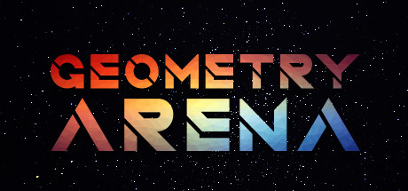

[Geometry Arena](https://store.steampowered.com/app/1255650/) v1.1.0 を日本語で遊べるようにする、非公式の日本語化MODを作りました。

## 使い方

1. 下のボタンからインストーラをダウンロードする
2. ダブルクリックして `1` を押す

Steam から入れていれば、ゲームの場所は自動で見つかります。
元に戻すときは、同じEXEを実行して `2` を押すだけです。
書き換える前にバックアップを取ります。

[ダウンロード (v1.0.0)](https://github.com/4sou9/geometry-arena-jp/releases/download/v1.0.0/GeometryArenaJP-Installer.exe "btn")

途中で「WindowsによってPCが保護されました」と出たら、**詳細情報** から **実行** を選んでください。
署名していない個人製のEXEなので出ます。

## 翻訳した範囲

UI、クラス、スキル、強化、ルーン、図鑑、チュートリアルの1430箇所です。
更新履歴と制作スタッフの人名は英語のままにしています。

日本語は中国語の枠を上書きしているので、埋め込みフォントのままだと漢字が中国語の字形で出ます。
そのためフォントも Noto Sans JP に差し替えました。
英語の表示は残っているため、ゲーム内の言語切り替えで英語に戻せます。

ソースコードと翻訳データはこちら。

https://github.com/4sou9/geometry-arena-jp
