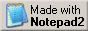
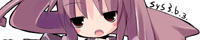
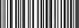

リンクのページを作りました。
普段使っているサイトと、入れておくと便利なソフトをまとめています。
相互リンクも募集しているので、ページの最後にあるバナーを持って行ってください。

## ブラウザ

まだ Internet Explorer で見ている人がいたら、Netscape に乗り換えることをおすすめします。
表示が速く、CSS の解釈も素直です。
当サイトは Netscape 4 以上で確認しています。
どうしても IE でないと動かないページがあるので、両方入れておくのが現実的だと思います。

Netscape の流れを汲む Firefox も出ています。
最近は Chrome というのも見かけるようになりました。

:::banners

:::

## 検索とホームページスペース

探しものは Yahoo! か AltaVista で足ります。
最近 Google というのが出てきていて、これが思ったより当たりが良いです。
自分のページを置く場所は GeoCities が無難でしょう。
容量は少ないですが、日本語のサポートがあるのは大きいです。

:::banners

:::

## 入れておくと便利なソフト

音楽を聴くなら Winamp、圧縮ファイルを開くなら WinZip です。
WinRAR や 7-Zip でも構いません。
絵を描くなら Gimp、立体を作るなら Blender が無料で使えます。

あとは Flash と Shockwave と QuickTime と RealPlayer を入れておいてください。
入れていないと何も表示されないページがけっこうあります。

:::banners

:::

## 最近見つけたサービス

Twitter に登録しました。
短い文を投稿するところで、更新のお知らせはこちらに流します。
Discord のサーバも作ったので、話したい人はどうぞ。
チャットは mIRC のほうが軽いですが、人が多いのはこちらです。

調べものは Wikipedia が早いです。
買い物は Amazon と eBay でたいてい足ります。
ゲームは Steam でまとめて管理できるようになりました。
CD を入れ替えなくていいのが楽です。

:::banners

:::

## サイト作りに使っているもの

ホームページ作成ソフトは使っていません。
メモ帳で HTML を直接書いています。
慣れるとそのほうが速いです。
フレームと JavaScript は使わない方針です。

書いたら W3C の検証サービスに通してください。
通ればバナーがもらえます。
HTML5 というのも出ているそうですが、まだ様子を見ています。

掲示板を置くならデータベースが要ります。
うちは Apache と PHP と MySQL で、サーバは Debian です。
書いたものは GitHub にも置いてあります。

:::banners

:::

## メーカーさんのバナー

公式サイトが配布しているものを貼っています。
日本では 200x40 が主流なので、88x31 の枠には入りません。
リンクのページは横幅を広めに取っておくと楽です。

:::banners

:::

同人サイトさんやイベントのバナーもまとめてここに置いておきます。
いただいたものと、リンクをたどって拾ってきたものが混ざっています。

:::banners

:::

## 当サイトのバナー

リンクはフリーです。
報告は不要ですが、いただけると喜びます。
直リンクはサーバに負担がかかるので、保存して自分のところに置いてください。

:::banners

:::

## バナーを探せるところ

うちに貼ってあるバナーは、だいたいこの二つから持ってきました。
まず 88x31 のほう。
枚数が多いので、目当てのものを探すというより眺める場所です。

https://cyber.dabamos.de/88x31/index.html

アニメと美少女ゲーム系はこちらが充実しています。
200x40 とブリンキーが種類別に分かれていて探しやすいです。

https://wwdayo.wixsite.com/y2kawaii-web

閉鎖したサイトのバナーを探すときは Wayback Machine を使っています。

https://web.archive.org/

:::info
ここに並べたバナーの権利は、それぞれの制作者にあります。
配布や再利用を意図した掲載ではありません。
掲載を望まないものがあれば取り下げます。
:::
