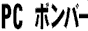
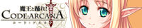
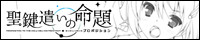

ようこそ！ここは管理人のお気に入りリンク集です(^^)
相互リンク大歓迎です。当サイトのバナーは一番下にあります。

## ブラウザ

当サイトはネスケ3.0以上、800×600での閲覧を推奨しています。
IEだとレイアウトが崩れるかもしれません(汗
文字だけ読むならLynxが最速です。

:::banners

:::

## 検索とホームページスペース

探し物はYahoo!→AltaVistaの順が基本です。
最近はGoogleもかなり当たります！
このHPはジオシティーズで作りました。無料で借りられます♪

:::banners

:::

## 入れておくと便利なソフト

管理人愛用のソフトたちです。
Winampは必須！RealPlayerとQuickTimeとFlashも入れておきましょう。
ダウンロードしたらウイルスチェックを忘れずに！

:::banners

:::

## 最近見つけたサービス

最近見つけて便利だったサービスです。
Amazonで本を頼んだら、次の日に届いてびっくりしました。

:::banners

:::

## 毎日見ているサイト

管理人が毎日巡回しているサイトです。
HTMLで困ったら、とほほのWWW入門を見れば大体わかります。
侍魂の先行者には腹筋が崩壊しました(ﾟ∀ﾟ)

:::banners

:::

## サイト作りに使っているもの

このサイトはメモ帳だけで作っています。
W3Cの文法チェックもちゃんと通りました♪
フレームは使っていないので、ブックマークはどのページにでもどうぞ。

:::banners

:::

## メーカーさんとゲーム

好きなメーカーさんと、やったゲームのバナーです。
公式サイトで配布されているものをお借りしています。

### Key

泣きゲーといえばここ。

:::banners

:::

### Tactics

ONEをやってないなら人生損してます。

:::banners

:::

### ニトロプラス

沙耶の唄は夜中にやるとトラウマになります(((( ；ﾟДﾟ)))

:::banners

:::

### 07th Expansion

同人ゲームとは思えないボリュームです。

:::banners

:::

### オーガスト

キャラデザがとにかくかわいい！

:::banners

:::

### ゆずソフト

キャラがとにかくかわいいです(*´∀`*)

:::banners

:::

### パープルソフトウェア

昔からずっと追いかけてます。

:::banners

:::

### ケロQ

素晴らしき日々は覚悟してから始めてください。

:::banners

:::

### propeller

燃えゲーならここです。

:::banners

:::

### ういんどみる

はぴねす!は何周もしました(^^)

:::banners

:::

### フロントウイング

ジブリールはシリーズ全部持ってます。

:::banners

:::

### minori

OPムービーだけでも見る価値ありです。

:::banners

:::

### feng

:::banners

:::

### ハイクオソフト

ののちゃんがかわいすぎます。

:::banners

:::

### Lump of Sugar

:::banners

:::

### クロシェット

:::banners

:::

### MOONSTONE

:::banners

:::

### Whirlpool

:::banners

:::

### FAVORITE

:::banners

:::

### HOOKSOFT

:::banners

:::

### ぱれっと

:::banners

:::

### ユニゾンシフト

:::banners

:::

### sprite

:::banners

:::

### サーカス

:::banners

:::

### ブロッコリー

:::banners

:::

### しとろんソフト

:::banners

:::

### PULLTOP

夏少女からずっと追いかけてます。

:::banners

:::

### あてゅ・わぁくす

ほのぼのしたいときはここです(^^)

:::banners

:::

### Sugar pot

:::banners

:::

### Cabbit

:::banners

:::

### AXL

:::banners

:::

### SAGA PLANETS

:::banners

:::

### イエティ

:::banners

:::

### すみっこソフト

:::banners

:::

### ぷちフェレット

ぽぽたんは名作です！

:::banners

:::

### Aries

:::banners

:::

### CATWALK

:::banners

:::

### Terios

:::banners

:::

### ALcotハニカム

:::banners

:::

### HIBIKI WORKS

:::banners

:::

### COSMIC CUTE

:::banners

:::

### MEPHISTO

:::banners

:::

### FLAT

:::banners

:::

### 零式。

:::banners

:::

### UnicoЯn

:::banners

:::

### ほかにも好きなメーカーさん

:::banners

:::

## 同人ショップと印刷所

イベントに行けないときは通販で買ってます。
本を出すときはこちらの印刷所さんにお願いしています！

:::banners

:::

## アニメとサーチ

アニメの公式HPと、よくお世話になるサーチです。

:::banners

:::

## 当サイトのバナー

リンクフリーです！報告は任意ですが、いただけると喜びます(^^)
バナーは直リンク禁止です。お持ち帰りでお願いします。

:::banners

:::

## バナーを探せるところ

ここに貼っているバナーは、こちらのサイトからお借りしました。感謝です！

https://cyber.dabamos.de/88x31/index.html

https://wwdayo.wixsite.com/y2kawaii-web

https://tters.jp/banner

閉鎖してしまったサイトも、Wayback Machineでまだ見られます。

https://web.archive.org/

:::info
ここに並べたバナーの権利は、それぞれの制作者にあります。
配布や再利用を意図した掲載ではありません。
掲載を望まないものがあれば取り下げます。
:::
